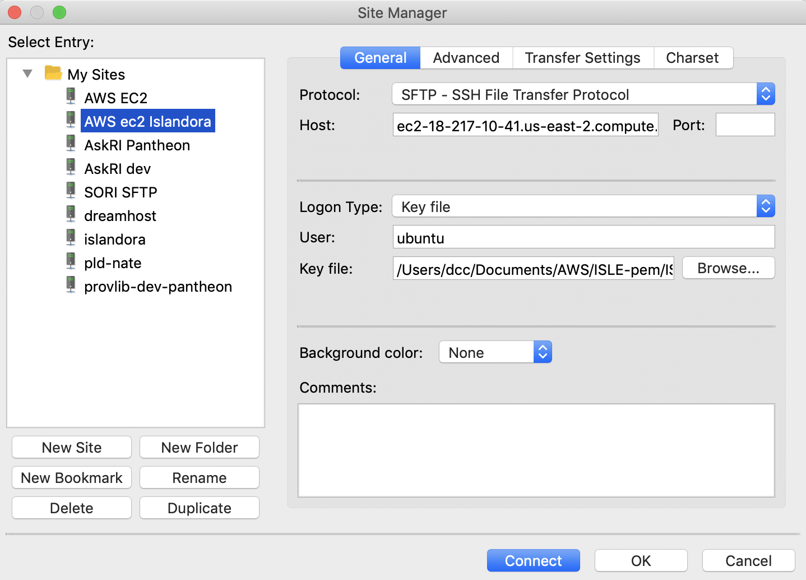
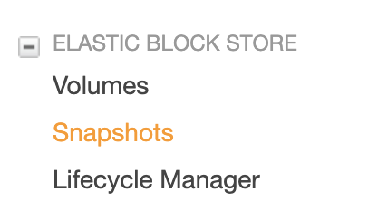

# Amazon AWS &amp; Docker
---

**Table of contents**

* [Amazon EC2](#amazon-ec2)
  - [Backing Up The EC2 Instance](#backing-up-the-ec2-instance)
* [Docker Information](#docker-information)
  - [Accessing a Docker container to add or modify content](#accessing-a-docker-container-to-add-or-modify-content)


## Amazon EC2
We use Amazon Web Services for hosting for ProvLibDigital.org.  In order to connect to our AWS EC2 instance using an SFTP client or using SSH you need a [.PEM File](https://docs.aws.amazon.com/AWSEC2/latest/UserGuide/ec2-key-pairs.html). That file needs to be created in the EC2 admin.  The PEM File I use is located on the DCC iMac at `/Users/dcc/Documents/AWS/ISLE-pem/ISLEIslandoraKey.pem`.  This file can be used on more then one machine.

**To connect to EC2 via an SFTP client**



1. Add the Host as found in the ec2 admin.
  1. For PLD the host is **ec2-18-217-10-41.us-east-2.compute.amazonaws.com**
2. For Logon Type select Key file
  1. User = ubuntu
  2. Key file: /path/to/the/PEM/file.PEM

**To connect to EC2 via SSH**

1. Open Terminal or iTerm
2. Navigate to the directory that contains the PEM file
2. From that directory enter this command `ssh -i [pem-file-name].pem [user]@[aws-ec2-url]`
  * The command for accessing the PLD ec2 instance from the DCC iMac would be:

```sh
ssh -i ISLEIslandoraKey.pem ubuntu@ec2-18-217-10-41.us-east-2.compute.amazonaws.com
```
3. Once you've logged in via SSH change to the super user

```sh
sudo su
```

You need to be the super user to run any docker commands.


## Backing Up The EC2 Instance

This is currently done manually whenever I am pushing up new content or code to our Islandora repository.

**How to backup the ec2 instance**

1. Log in to the AWS dashboard and select EC2 dashboard
2. On the **EC2 Dashboard** siderail select **Snapshots** under the **Elastic Block Storage** menu.



3. On the snapshots screen click the blue button labeled **Create Snapshot**
4. On the **Create Snapshot** screen select **Volume** for **Select resource type**.
  1. Under the **Volume** dropdown select **vol-0813f432b100806b8 - Islandora**.
  2. Give the snapshot a meaningful description.
  3. Click **Create Snapshot**

I usually delete the oldest snapshot in the snapshots section once the snapshot I just made has completed.

## Docker Information

:link: [Docker Documentation](https://docs.docker.com/)

:link: [Helpful Docker Tutorials](https://docker-curriculum.com/)

:link: [Download Docker Community Edition](https://www.docker.com/products/container-runtime)

Docker is an application that makes it easy to develop, deploy and run applications across different environments. Basically docker makes it fairly painless to port an application from one enviornment to another without having to install and configure the dependencies an application requires for each environment.

Our Islandora repository is running via a Dockerized version of Islandora called [ISLE](https://islandora-collaboration-group.github.io/ISLE/).

Reading the ISLE documentation above will give you all the info you need to get up and running on how ISLE is configured, how to install a copy of it locally, how to migrate an running ISLE repository to a remote server.

---

:link: [ISLE Cheat Sheet: Docker Commands](https://islandora-collaboration-group.github.io/ISLE/cookbook-recipes/isle-cheatsheet-docker-commands/)
- A helpful cheat sheet of Docker commands you will need to know to start/stop/update the docker containers in ISLE.

---

### Accessing a Docker container to add or modify content

In order to add Drupal/Islandora modules or run a batch ingest of new content into our Islandora repository you need to run Drush commands while in the Docker Apache container.

**Find out what Docker containers are running**

1. Open Terminal or iTerm and navigate to the directory that contains ISLE (either locally or on the ec2 instance).
2. In that directory run this command

```sh
docker ps -a
```
This shows all running and stopped docker containers.
The output of that command should look like this:
```sh
CONTAINER ID        IMAGE                                         COMMAND                  CREATED              STATUS              PORTS                                                              NAMES
33558e75d242        islandoracollabgroup/isle-imageservices:1.1   "/init"                  54 seconds ago       Up 51 seconds       0.0.0.0:8083->8080/tcp                                             isle-images-provlib
04943e02ea01        islandoracollabgroup/isle-apache:1.1          "/init"                  58 seconds ago       Up 53 seconds       80/tcp                                                             isle-apache-provlib
1f561ce1e5bd        islandoracollabgroup/isle-fedora:1.1          "/init"                  About a minute ago   Up 57 seconds       0.0.0.0:8081->8080/tcp                                             isle-fedora-provlib
c87962a58c8c        islandoracollabgroup/isle-solr:1.1            "/init"                  About a minute ago   Up About a minute   8983/tcp, 0.0.0.0:8082->8080/tcp                                   isle-solr-provlib
f393109bc7b7        traefik:latest                                "/traefik"               About a minute ago   Up About a minute   0.0.0.0:80->80/tcp, 0.0.0.0:443->443/tcp, 0.0.0.0:8080->8080/tcp   isle-proxy-provlib
82fa2f81490f        islandoracollabgroup/isle-mysql:1.1           "docker-entrypoint.s…"   About a minute ago   Up About a minute   0.0.0.0:3306->3306/tcp, 33060/tcp                                  isle-mysql-provlib
a2ef5a5cfd65        portainer/portainer                           "/portainer -H unix:…"   About a minute ago   Up About a minute   0.0.0.0:9010->9000/tcp                                             isle-portainer-provlib
```
The very last column **NAMES** contains the name of each container.

**Shell into a Docker container**

If I wanted to modify files or run drush commands in the container ` isle-apache-provlib ` I would need to enter this Docker command:

```sh
  docker exec -it isle-apache-provlib bash
```
This would shell into the isle-apache-provlib container at the root directory. From there I could run...

```sh
cd /var/www/html
```

...to access the root of the Drupal instance and from there run `drush` commands.

Or I could navigate to the islandora modules directory...

```sh
cd sites/all/modules/islandora
```
... and then git clone the repo of an islandora module I wanted to install

```sh
git clone https://github.com/axfelix/islandora_solution_pack_database.git
```

Anyway, what I'm getting at is that working in Docker containers is a must to run drush for maintenance purposes, install modules, update theme code, or ingest repository content using drush.

I go into more detail about the ingest process, updating theme code, and the structure of our site theme in the **ProvLibDigital.md** file.
