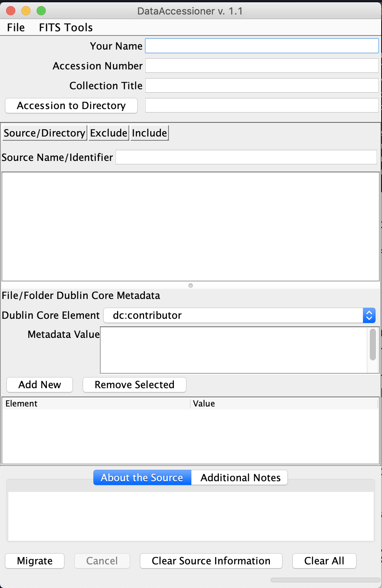
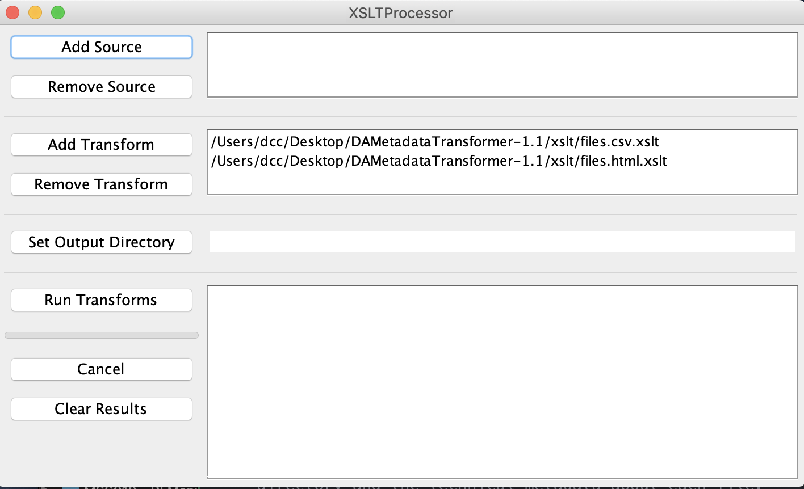
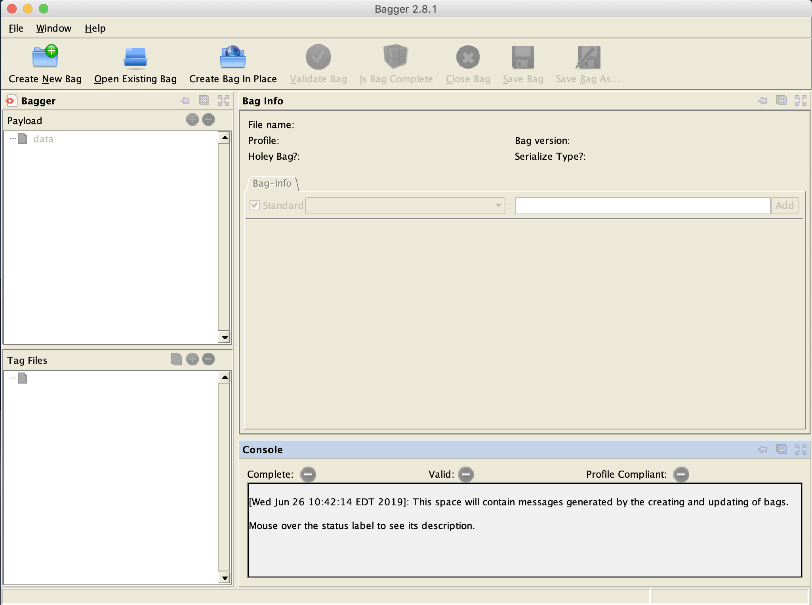

# Digital Collections Information
---

**Table of contents**

* [Collections Processing Status](#collections-processing-status)
  - [Bagged Collections](#bagged-collections)
  - [Collections that need to be bagged](#collections-that-need-to-be-bagged)
* [Data Accessioner and DA Metadata Transformer](#data-accessioner-and-da-metadata-transformer)
* [LOC Bagger](#loc-bagger-tool)

## Collections Process Status

The following collections have been run through Data Accessioner and have technical metadata files listing the types of files and sizes. These collections have also been bagged and can be checked using fixity.

* **002-03-03 - RI Mills and Mill Villages Photograph Collection**
* **002-03-05 - Rhode Island Stereocard Collection**
* **031-03 - Harold Mason Photograph Collection**
* **038-03 - Laurence E. Tilley Photograph Collection**
* **040-03 - Avery Lord Photograph Collection**
* **074-02 - UPP Arts Collection**
* **002-03-01_RI-Postcard-Collectoin** - This is on the desktop of the iMac in the DCC office. It needs to be moved to PPLBackup2418. I was not able to do that before I left...

These collections are stored on internal server PPLBackup2418 in `Collections / Bagged Collections /`

#### Locations of Collections on external HDs

**Western Digital 4TB External HD - My Book**
* Location - DCC Office. Drive has a label on it "External HD Collections Back Up - to 2017".
  - **Contains the following backups - all contain master and access (if applicable)**
    - 074-02 - UPP Arts _(already bagged)_
    - DC2014_01 - Teen Tech Squad, Summer 2014 _(already bagged)_
    - DC2015_02 - Teen Tech Squad, Summer 2015 _(already bagged)_
    - DC2015_03 - Providence 2050 - Visualizing Tomorrow Interviews _(already bagged)_
    - DC2015_04 - Teen Squad, Fall 2015, Downcity and Kennedy Plaza _(already bagged)_
    - DC2016_01 - ProvLib.org Website Capture
    - DC2016_02 - Louis Fazzano Oral History
    - DC2016_03 - PPL Oral History Collection
    - DC2016_04 - Edith Wetmore Collection of Children's Literaure
    - DC2016_05 - Daniel Berkeley Updike Collection on History of Printing
    - DC2016_06 - Series of Original Songs, Shaw
    - DC2016_07 - Social Sacred Melodist, Shaw
    - DC2016_08 - Alfred Brownell Collection
    - DC2016_09 - PPL Collection of Magic Lantern Glass Slides
    - MSS001 - Nicholson Whaling Collection
    - MSS004 - Harris Manuscript Collection
    - MSS010 - RI Manuscripts Collection
    - MSS016 - Arnold Autograph Collection
    - MSS023 - John Archer Collection
    - MSS027 - Harris Ephemera Collection
    - MSS029 - Daniel Berkeley Updike Ephemera Collection
    - VM003 - Harold Mason Photograph Collection _(already bagged)_
    - VM005 - Rhode Island Mills Photograph Collection _(already bagged)_
    - VM006 - Dorothy Bell Collection of Valentines
    - VM010 - PPL Photograph Collection
    - VM011 - John Hutchins Cady Research Scrapbooks
    - VM012 - PPL Collection of Stereocards
    - VM013 - RI Photograph Collection
    - VM015 - Lawrence E. Tilley Collection _(duplicate of copy below)_
    - VM015 - Lawrence E. Tilley Photograph Collection _(bagged copy of above - newer bagged version is on PPLBackup2418)_
    - VM018 - Avery Lord Aerial Photo Collection _(already bagged)_
    - VM021 - Edward Ozog Photograph Collection

**NOTE** _The collection numbers on the External HD are all old and not longer accurate. Please refer to the [Collections Process Status Google Sheet](https://docs.google.com/spreadsheets/d/1MW66wXHPDyDdcArZLqig214mo7flgK-34D6ohmHUI8Y/edit#gid=0). You will may need to have Kate Wells give you permission to view. This document list all collections, their correct collections number, and their processing status.

**Western Digital 4TB External HD - My Book**
* Location - DCC Office. Drive has a label on it "002-06 Rhode Island Atlas Scans - TDAC"

**Seagate - Ultraslim Portable Drive**
* Location - DCC Office. Drive contains master copies of UPP Arts Collection. Drive has a label on it "UPP Arts Master".

**Seagate 4TB Expansion Drives - 5 total drives**
* Location - DCC Office.
  - Drives -
    - **AS220 VHS Archive Batch 1**
    - **AS220 VHS Archive Batch 1 Continued Batch 2**
    - **AS220 VHS Archive Batch 2 Continued**
    - **AS220 Batch 1 Drive 1 of 2**
    - **AS220 Batch 1 Drive 2 of 2**

## Data Accessioner and DA Metadata Transformer

:link: [Documentation](http://dataaccessioner.org/)

Data Accessioner is a simple tool that you can use to migrate a directory of digitized objects to either your desktop or a network drive. In the process of migrating those files DA will run [FITS](https://projects.iq.harvard.edu/fits/home) on each file in the directory and produce extract technical metadata about each object. This data is written to an CML file within the parent directory.

After migrating a directory you can use DA Metadata Transformer to take the XML file and generate a CSV file and HTML file listing all of the files in the directory and the technical metadata about each file.

I've included examples in this directory taken from the migration of **002-03-01_RI-Postcard-Collection**.

* [002-03-01.xml] - The XML file generated by Data Accessioner during file migraion.
* [002-03-01_files.csv] - File generated by running the XML file through DA Metadata Transfomer. A CSV file listing the same information as the XML file.
* [002-03-01_files.html] - HTML file generated by running the XML file through DA Metadata Transformer. An HTML file listing the same information as the XML file.

### Using Data Accessioner
1. Open Terminal or iTerm.
2. Navigate to the location of the directory where DA is installed.
3. Inside the DA directory run this command `./start.sh`.
4. DA will launch and GUI will appear.
5. Enter the information into the form fields.
  1. **Accession Number** - The collection number as indicated on the [Collections Process Status Google Sheet](https://docs.google.com/spreadsheets/d/1MW66wXHPDyDdcArZLqig214mo7flgK-34D6ohmHUI8Y/edit#gid=0).
  2. Collection Title - The collection title, obv.
  3. Accession to Directory - a directory I've created where I'm planning to migrate the files. Either on my desktop or on a networked drive.
  4. Click the **Source/Directory** button to navigate to the directory you want to pull files from. I don't pull the access copies, just the directory containing the master copies.
  5. DA will load the contents of the directory into the window below. Depending on the number of files and file size(s) this can take a bit.
  6. Use the **Exclude** button to find any files you don't want to migrate or generate technical metadata about. Usually I'm just looking for hidden files like `.DS_STORE` files and excluding those.
  7. You have the option of entering descriptive metadata (in Dublin Core) about the collection. I don't bother since this data is usually already collected during digitization.
  8. Click migrate and let the program run.  On the bottom of the GUI window messages about the migration process will appear.

### Using DA Metadata Transformer
1. Wait for DA to finish migrating / generating FITS metadata.
2. When DA has finished navigate to where DA Metadata Transformer is installed.
3. Open the folder and click on the file named **XSLTProcessor.jar**. This will launch the program.
4. Once the DAM GUI has loaded click the **Add Source** button. 
5. Navigate to the XML file generated by Data Accessioner.
6. By default DAM will perform XML transforms on that file and convert the data to CSV and HTML. You can add additional XLST transform within the DAM xslt directory to convert that XML to different data types (_ex: add a transform that migrates the data to JSON_).
7. Click **Select Output Directory** and navigate to where you want the CSV and HTML files to be written. I usually write them to the same directory as the XML file.
8. Click **Run Transforms**.

## LOC Bagger

:link: [Documentation](https://github.com/LibraryOfCongress/bagger)

Running LOC Bagger can be resource intensive and really slow down the work station running it. I recommend having a dedicated work station to run LOC Bagger and then let it run. Bagger doesn not provide any status or process information once you start running it. On the command line you get a message stating that Bagger is bagging the directory, but no messages as the program goes through and generates checksums for each file. The GUI also gives no progress updates as it runs.

### Using LOC Bagger.

1. Open Terminal or iTerm.
2. Navigate to where Bagger is installed.
3. In the bagger directory cd into the directory **bin**
4. Run this command `./bagger`
5. Once the GUI has loaded you have a few options.
  1. If you click **Create New Bag** the program will copy each file in the directory you choose to bag.
  2. If you select **Create Bag in Place** the program will just generate checksums for each file in the directory and create the manifest files you can use to check fixity. I typically do this since I've already migrated the files using Data Accessioner.
6. Depending on what you select a window will appear prompting you to select a directory to bag (either new bag or in place). Navigate to the directory you want to bag.
7. Leave the **Select Profile** option as is `<no profile>`.
8. Check the **.keep Files in Empty Folder...**.
9. Click **OK** to begin bagging the directory.
10. Bagger will run in the background. When it finishes a dialog box will appear letting you know the process is finished.
