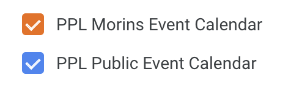
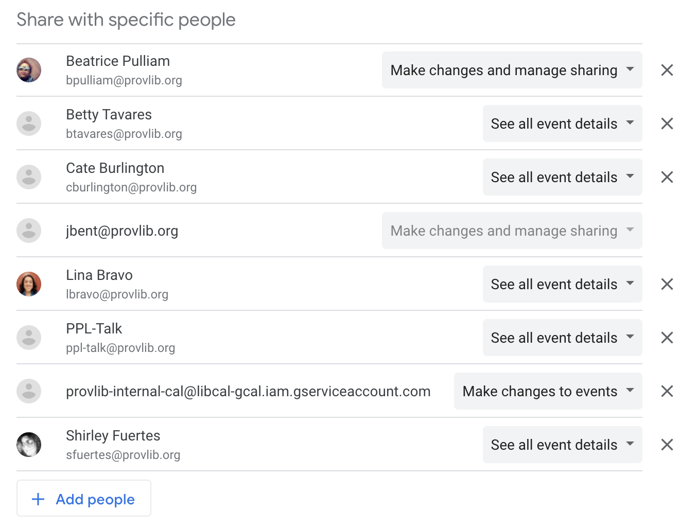
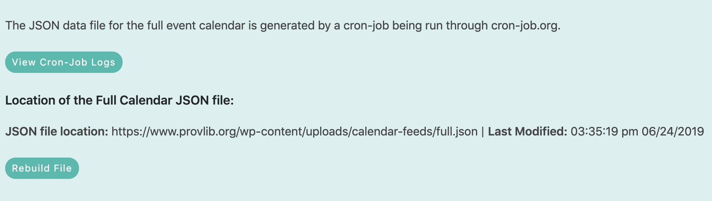

# LibCal
----
### Table of Contents

* [LibCal Admin](#libcal-admin)
* [Google Calendar Integration](#google-calendar-integration)
* [LibCal For WordPress plugin](#libcal-for-wordpress-plugin)

## LibCal Admin
---
:link: **LibCal Admin** [http://provlib.libcal.com/admin.php](http://provlib.libcal.com/admin.php)

:link: **LibCal Front End** [http://provlib.libcal.com](http://provlib.libcal.com)

:link: **LibCal Support** [https://ask.springshare.com/libcal](https://ask.springshare.com/libcal)

LibCal is a third party event calendar application Provience Public Library uses to schedule both public and private events and reserve spaces in the library for internal meetings or public events.

The private event calendar, **PPL Morins Calendar** (_calendar ID number 8193_), is used to reserve spaces in the library for internal meetings and events booked by Morins.

The front facing calendar, **PPL Public Event Calendar** (_calendar ID 8194_), is used to reserve spaces for Library Events in the physical space of the library. It is also used to add events for spaces held offsite.

The **PPL Public Event Calendar** can be viewed on LibCal or on ProvLib.org via a WordPress plugin that pulls event data out of LibCal using their API.

#### LibCal Front End Display

LibCal provides a [front end presentation of the event calendar](http://provlib.libcal.com).
There is an [admin area where you can modify/style the display of the calendar](https://provlib.libcal.com/admin_look.php?action=0). You can add custom CSS, javascript, and html code for the header and footer of the display. You can edit the look the libcal homepage, [here](https://provlib.libcal.com/admin/look-and-feel/page/9196).

You can edit the look of the event page (the page libcal displays when you are viewing a single events details) [here](https://provlib.libcal.com/admin/look-and-feel/page/8505).

LibCal also offers an "Hours Page" to display the hours of the library on the LibCal front end calendar pages. We aren't using this currently, however it can edited [here](https://provlib.libcal.com/admin/look-and-feel/page/8507).

The main customizations I made to the front end display of LibCal was adding code to the header and footer and adding some global css for those sections. That code is all [available here](https://provlib.libcal.com/admin_look.php?action=0).

#### LibCal Event Registrations

The main thing we use the LibCal front end for is event registrations. We display information about events, and various types of event listings on [ProvLib.org](https://www.provlib.org/calendar). If an event has limited seating, or we want to track who is attending, we use LibCal's event registration forms. Those can be set in the calendar admin when you add a new event.  We don't have anyway of allowing registrations on ProvLib.org, so the calendar areas on ProvLib.org link out to the individual event page on LibCal. Those pages contain the event registration forms.

[Here's an example of an event page on ProvLib.org](https://www.provlib.org/calendar/?id=5285327&d=2019-09-03).

[Here is what the LibCal Front End page with a registration form looks like for that event](https://provlib.libcal.com/event/5285327).

#### Adding New Event in Libcal

You mostly don't need to handle adding events. Tonia and other people in the organization handle adding or editng events via LibCal's admin. You may be called on to debug issues with events once they are added, or help to edit them.

[Here is the LibCal support section on Calendars and Events](https://ask.springshare.com/libcal/search/?t=0&adv=1&topics=Calendars%20%26amp%3B%20Events).

You'll find tutorials on adding events, editing events, using the bulk import option for adding events.

## Google Calendar Integration
---

LibCal offers the ability to sync event calendars to an organizations Google Calendar. This is currently set-up and working, however occasionally a someone will have an issue getting the PPL Morins or Public Event calendar to display, or events that have been edited won't sync to the Google Calendar. [Here are instructions on how to sync a LibCal calendar to Google Calendar](https://provlib.libcal.com/calendar_gsync.php?cal_id=8194).

**If a staff member can't see the PPL Morins calendar or the PPL Public Event calendar in Google Calendar**

The easiest thing to do is to send them a link to the calendar. Follow these steps:

1. Find the **PPL Morins** or **PPL Public** calendar in the Google Cal siderail navigation. 
2. Select the calendar you want to share and click the veritcal dots icon **&vellip;** then select **Settings and sharing** 
3. Find the **Share with specific people** option. Click the **+ Add people** button. Add the email address(es) of the individual(s) in the org who need access. 
4. An email will be sent to those people added with a link to the calendar. After clicking the link the calendar should be accessible via the **My calendars** siderail option.

**Events not synching after editing/deleting**

This most likely won't be an issue going forward, however, if this does pop up as an issue here is the likely cause and how to fix the problem.

1. **Events added in bulk via the [event importer](http://provlib.libcal.com/admin/event-import) don't sync with Google Calendar**, even when edited. This is a bug with LibCal. **Events that are manually added using the Add New Event form do sync**, as do edits to those events.
2. If an event is not syncing after edit it is most likely an event added using bulk import. To get the event to sync to Google Calendar you need to create a new event via the **Add New Event form**, copy the details of the event that is not syncing, then delete the old event.

## LibCal For WordPress
---

LibCal for WordPress is an internally built WordPress plugin that pulls in event data from the LibCal's Calendar API.

:file_folder: **Codebase** /Users/dcc/Sites/ppldev/wp-content/plugins/libcal-for-wordpress/

#### Plugin Directory Structure
:open_file_folder: - **libcal-for-wordpress**
* :open_file_folder: - **dist** - minified javascript files used in the various shortcode implementations for the various calendar displays. Don't edit these files. Edit the files in the **js** directory. **Gulp** handles converting the files in the **js** directory to minified versions for production.
* :open_file_folder: - **feeds** - These are the files that are used to build the JSON data files that are served to the full calendar and the list display.
  - **full-calendar.php** - build the full calendar data file
  - **rebuild-full-calendar.php** - same as above except this outputs to the browser a log of the event data pulled from the API when the script was run.
  - **rebuild-widget.php** - builds the list display JSON data file file and outputs to the browser a log of the event data pulled from the API when the script was run.
  - **widget.php** - rebuilds the list display JSON data file
* :open_file_folder: - **images** - contains images being used in the WordPress admin area.
* :open_file_folder: - **inc** - All of the scripts containing the functions for both the display and admin areas of the plugin. Each directory also contains a script called **token.php** that contains the curl function used to connect to libcal and pull data from the API.  The **load_scripts.php** file is used to enqueue and css or js files used in the admin or display functions.
  - :open_file_folder: - **admin** - admin functions - all of the scripts that generate display and functionality of the admin pages in the WordPress dashboard.
  - :open_file_folder: - **display** - scripts for the front end display of the Full Calendar, The List Display and The Featured Events row.
* :open_file_folder: - **js** - all javascript files used in the plugin.
  - **clndr.js** - Third party javascript library that generates the calendar navigation on the Full Calendar page.  [Documentation](http://kylestetz.github.io/CLNDR/)
  - **filter-code.js** - some js I was keeping as a reference. This is just the code I was working on that filters events by category tag. This file is just around for reference and can be deleted.
  - **full-caldendar.js** - The jQuery that is used in the full caldendar.
  - **iScroll.js** - javascript library that generates the horozontial scroll bar and calculates the width of the parent container holding all events. This only applies to instances of the Featured Event Row. [Documentation](https://github.com/cubiq/iscroll)
  - **lcwp-admin** - javascript that is used in the libcal-for-wordpress admin areas. Mostly on the Featured Events list section.
  - **moment.js** - javascript library that handles converting date objects into human readable dates. Used widely through out the plugin. [Documentation](https://momentjs.com/)
  - **widget.js** - jQuery used to pull event data into the List Display Widget
* :open_file_folder: - **sass** - SCSS files used to generate the style.css file.
* :open_file_folder: - **index.php** - placeholder index file. This needs to be here but doesn't do anything.
* :open_file_folder: **libcal-for-wordpress.php** - script that is run when teh plugin is activated. Handles loading all of the scripts in the **inc directory**.

#### Calendar Shortcodes

The plugin generates a few different views of event data pulled out of LibCal. Those displays are all generated using [shortcode](https://github.com/JohnProvidence/Digital-Content-Coordinator-Documentation/blob/master/ProvLib-Shortcodes.md).

Most of the displays of event data are controlled by the shortcodes listed below. Refer to the documentation links for information about those shortcodes and the functions that controll how the event data is displayed.

**Featured Event Row**
:link: [Documentation](https://github.com/JohnProvidence/Digital-Content-Coordinator-Documentation/blob/master/ProvLib-Shortcodes.md#featured-events-row)

**Library Calendar**
:link: [Documentation](https://github.com/JohnProvidence/Digital-Content-Coordinator-Documentation/blob/master/ProvLib-Shortcodes.md#library-calendar)

**Calendar List Display**
:link: [Documentation](https://github.com/JohnProvidence/Digital-Content-Coordinator-Documentation/blob/master/ProvLib-Shortcodes.md#calendar-list-display)

#### Calendar Cron Job

The [Full Calendar](https://provlib.org/calendar) pulls event data from a JSON file. This data file contains events pulled from the LibCal API starting two weeks in the past and going foward one year. LibCal's API limits the amount of events you pull out to 500. So the data file has a maximum of 500 events. PPL tends to add lots of repeating events, so that 500 events usually maxes out around 6 months in the future. The Full Calendar on ProvLib.org does not load any past events beyond two weeks in the past.

That file is generated by a script in the LibCal-For-WordPress directory.  The cron job that generates this file is set-up and run at [Cron-Job.org](https://cron-job.org/en/). Cron-Job.org is a free web service that runs scheduled tasks. You need to have an account to use Cron-Job.org. Currently the Calendar cron jobs are run using an account linked to my ProvLib.org email address. These will need to be set-up under a new account. The cron job for the full calendar is run every two minutes.

You can also manually rebuild the full calendar data file by [visiting this url](http://live-ppldev.pantheonsite.io/wp-content/plugins/libcal-for-wordpress/feeds/full-calendar.php). Alternately, you can also rebuild the data file by using a button in the [Library Calendar Admin](https://www.provlib.org/wp-admin/admin.php?page=library-calendars).

Clicking the **Rebuild File** button above will launch a new browser window that will run the PHP script that builds that data file.  I mostly use this to rebuild the file if an event has been added by the cron job has not run yet.

##### Calendar List Display Cron Job

:link: [Example of the List Display on ProvLib.org](https://www.provlib.org/research-collections/) (_List Display is the Calendar to the right of the top image_).

This also uses a JSON data file pulled from LibCal. This only pulls events from the current date, going forward 30 days. That cron job is also run at Cron-Job.org. This file can also be rebuilt manually in the LibCal calendar admin (_click on the **Calendar Widget JSON** tab_).
