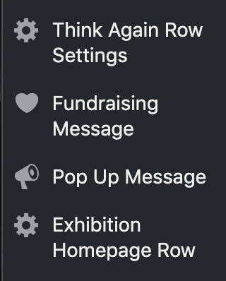

# ProvLib.org WordPress Theme
----
An overview of the structure of the PPL site theme. Initially designed and developed by Oomph Inc.

##### Quick Links
+ [Directory Structure](#directory-structure)
+ [Custom Post Types](#custom-post-types)
+ [Advanced Custom Fields](#advanced-custom-fields)
+ [Custom Theme Options](#custom-theme-options)

## Directory Structure
---
:file_folder: **ppl**

+ :open_file_folder: **images** - contains images used in the theme as section backgrounds and icons.
+ :open_file_folder: **inc** - contains several function files that are included in the functions.php file.  Functions that generate [shortcodes](https://github.com/JohnProvidence/Digital-Content-Coordinator-Documentation/blob/master/ProvLib-Shortcodes.md#capital-campaign-row), set-up admin options pages, define admin forms, and define widget areas are found here.
+ :open_file_folder: **js** - Javascript files
  - :page_facing_up: **customizer.js** - javascript for [WordPress Customizer](https://en.support.wordpress.com/customizer/)
  - :page_facing_up: **exhibition2019.js** - code that plots exhibition locations to a google map using the Google Maps API and the Google Maps GeoCoder API - this needs to have the new Goggle API keys added on line 113 (variable API_KEY).
  - :page_facing_up: **highcharts.js** - highcharts javascript code library. This is being used to display a couple of charts on [this page](https://www.provlib.org/teen-squad-overview/)
  - :page_facing_up: **locations.json** - an array of exhibition locations that are being called in the **exhibitions2019.js** file. This array feeds the locations displayed on the Google Map.
  - :page_facing_up: **navigation.js** - javascript that handles the toggle of the main navigation for small screens.
  - :page_facing_up: **ppl.js** - javascript file for functions used throughout ppl theme.
  - :page_facing_up: **skip-link-focus-fix.js** - javscript for keyboard only users.
  - :page_facing_up: **teen-squad.js** - parses json files used to pull Teen Squad IMLS grant data into [the Teen Squad IMLS Grant section](https://www.provlib.org/teen-squad-overview/). The json data is generated by a plugin file that reads a google spreadsheet and a google drive.
+ :open_file_folder: **layouts** - css files for sidebars and some global page builder styles.
  - :page_facing_up: **content-sidebar.css**
  - :page_facing_up: **ppl_styles.css** - global page builder styles defined by Oomph.
  - :page_facing_up: **sidebar-content.css**
+ :open_file_folder: **node_modules** - this folder is only found locally. It contains open source javascript task running tools installed using [npm js](https://www.npmjs.com/) that are used in local development. This file is ignored by git and is not pushed to Pantheon.
+ :open_file_folder: **scss** - SCSS files. These are compiled and minified into style.css (the themes css file).
  - :open_file_folder: **partials** - contains various scss files that define styles for different parts of the site. Also contains the _variables.css file, which defines various [scss variables and mixins](https://sass-lang.com/guide).
    - :page_facing_up: **_alum.scss** - PPL Alum ppl_styles
    - :page_facing_up: **_calendar.scss** - Full Calendar style overrides. _General calendar styles are defined in the LibCal For WordPress plugin_.
    - :page_facing_up: **_cc.scss** - Captial Campaign page ppl_styles
    - :page_facing_up: **_events.scss** - Styles used for the Savor The Story section of the site.
    - :page_facing_up: **_exhibition2019.scss** - Styles used for the 2019 Exhibition series
    - :page_facing_up: **_exhibitions.scss** - Styles used for the Programs &amp; Exhibitions section of the site.
    - :page_facing_up: **_featuredRows.scss** - Styles used in various homepage rows, mainly the PPL in the Community row
    - :page_facing_up: **_forms.scss** - Styles used on all Blackbaud form embeds.
    - :page_facing_up: **_fundraising.scss** - Styles used on the PPL Fundraising Message row. Currently displayed at the very top of ProvLib.org.
    - :page_facing_up: **_global.scss** - Global overrides for content found in page builder rows and templates.
    - :page_facing_up: **_highcharts.scss** - Styles for highcharts js charts
    - :page_facing_up: **_homepage.scss** - Styling for rows on the homepage - mainly the Think Again Capital Campaign row and the 2019 exhibition row.
    - :page_facing_up: **_hours.scss** - Styles for the library hours displayed via shortcode.
    - :page_facing_up: **_libguides.scss** - Styles for the Subject Guides section of the site. This section is not currently being used.
    - :page_facing_up: **_mq.scss** - media queries used to handle layout adjustments for responsive breakpoints. The breakpoints are defined in the _variables.scss file (they are all sass mixins).
    - :page_facing_up: **_oomph.scss** - the initial style sheet given to us by oomph.
    - :page_facing_up: **_passport.scss** - styles for the [Passport to Summer Learning](https://www.provlib.org/passport-to-summer-learning/)
    - :page_facing_up: **_pop-up.scss** - Styles for the site pop up window that displays on the homepage.
    - :page_facing_up: **_support.scss** - Styles for the Support Us page
    - :page_facing_up: **_teensquad.scss** - Styles for the Teen Squad IMLS grant section
    - :page_facing_up: **_variables.scss** - SASS variables and mixins used in all .scss files.
+ :open_file_folder: **template-parts** - template files that define the html structure for various pages / sections of the site.
    - :open_file_folder: **passport-sections** - sections used in the [Passport to Summer Learning](https://www.provlib.org/passport-to-summer-learning/). These files contain code to pull data out of Advanced Custom Fields.
    - :open_file_folder: **svg** - svg maps of each floor of the library. These are no longer being used.
    - :page_facing_up: **content-databases.php** - Displays Databases custom post type - this template is called on line 37 of single-databases.php.
    - :page_facing_up: **content-lib-guide.php** - Displays Subject Guides pages -- this page is not currently being used.
    - :page_facing_up: **content-none.php** - Displays a message if posts are not found
    - :page_facing_up: **content-page** - Template for displaying pages if Page Builder is not enabled for the page in question.
    - :page_facing_up: **content-post** - Template for displaying posts.
    - :page_facing_up: **content-search** - Search results page
    - :page_facing_up: **content-support** - Template for displaying the [Support Us page](https://www.provlib.org/support-us/)
    - :page_facing_up: **content.php** - Generic template for displaying content ...
    - :page_facing_up: **fundraising-message.php** - template for the fundraising message displayed at the top of the homepage.
    - :page_facing_up: **map-data.php** - This was used to display the library svg maps and pull data about each clickable portion of the floor plan to the page. This is no longer being used.
    - :page_facing_up: **ppl-pop-up.php** - Template for the pop up that displays on the homepage.
    - :page_facing_up: **sectional-tabbed.php** - Used in the LibGuides section of the site for a tabbed content guide. This is no longer being used.
    - :page_facing_up: **sectional.php** - Used in the LibGuides section of the site for a non-tabbed content guide. This is no longer being used.
    - :page_facing_up: **teaser-post.php** - Teaser post template...
+ :page_facing_up: **404.php** - 404 page template
+ :page_facing_up: **archive-databases.php** - Template for the [Databases custom post type archive page](https://www.provlib.org/databases/).
+ :page_facing_up: **archive-subject-guides.php** - Template for the Subject Guides custom post type archive page. This is no longer being used.
+ :page_facing_up: **archive.php** - Archive page template.
+ :page_facing_up: **comments.php** - Comments page. Comments on the site are disabled so this is not being used.
+ :page_facing_up: **footer-passport.php** - Footer being used on the [Passport to Summer Learning](https://www.provlib.org/passport-to-summer-learning/) page.
+ :page_facing_up: **footer.php** - Site Footer
+ :page_facing_up: **functions.php** - functions file. Defines theme functions. Many functions are defined in files found in the **inc/** directory.  Those files are included in this file.
+ :page_facing_up: **gulpfile.js** - javascript file used by npm.js task running tools. This is not part of the site theme, just used for local development.
+ :page_facing_up: **header-passport.php** - Header used on the Passport page.
+ :page_facing_up: **header-teensquad.php** - Header used on the Teen Squad IMLS section.
+ :page_facing_up: **header.php** - Site header.
+ :page_facing_up: **home.php** - Template for the homepage.
+ :page_facing_up: **index.php** - Main template file.
+ :page_facing_up: **page-alum.php** - PPL Alum page template. The template for [this page](https://www.provlib.org/support-us/ppl-alum/).
+ :page_facing_up: **page-art-project.php** - Template file for the [this page](https://www.provlib.org/support-us/ppl-alum/). This is a custom post type called "Art Project". A section of the site that features art works made using materials from PPL's Special Collections.
+ :page_facing_up: **page-calendar.php** - Template file for the event calendar.
+ :page_facing_up: **page-floor-maps.php** - Template file that was used to display SVG floor maps of the library. This is not currently being used.
+ :page_facing_up: **page-passport.php** - Template for the Passport To Summer Learning page.
+ :page_facing_up: **page-ppl-teen-squad.php** - Template for the PPL Teen Squad IMLS Grant page. This file is
+ :page_facing_up: **page-support.php** - Template file for the [Support Us](https://www.provlib.org/support-us/) page.
+ :page_faceing_up: **page-teen-squad-overview.php* - Template file for the [Teen Squad IMLS Grant dashboard](https://www.provlib.org/teen-squad-overview/).
+ :page_faceing_up: **page-teen-squad-resources.php** - Template file for single [Teen Squad IMLS Grant program page](https://www.provlib.org/teen-squad/my-city-my-place/).
+ :page_facing_up: **page.php** - Generic page template file.
+ :page_facing_up: **readme.txt** - ReadMe file.
+ :page_facing_up: **rtl.css** - CSS file that provides support for languages that are written Right to Left(RTL). This is not currently being used.
+ :page_facing_up: - **screenshot.png** - A screenshot of the theme that is displayed in the WordPress admin.
+ :page_facing_up: **search.php** - Template for the search page.
+ :page_facing_up: **searchform.php** - The search form that appears in the top navigation. This was modified to allow toggling between site search and search of OSL eBooks and Catalog.
+ :page_facing_up: **sidebar.php** - Template for the sidebar.
+ :page_facing_up: **single-art-projects.php** - Template for [single art projects custom post type pages](https://www.provlib.org/art-projects/blimey-magazine/).
+ :page_facing_up: **single-databases.php** - Template for individual [databases custom post type pages](https://www.provlib.org/databases/american-ancestors/). The databases custom post type is mostly used to feed the [archive page](https://www.provlib.org/databases/). The single template file is mainly here so people don't wind up looking at a blank screen if they wind up on a single databases page...This could probably be spruced up.
+ :page_facing_up: **single-ppl-alum.php** Template file for individual PPL Alum pages.
+ :page_facing_up: **single-subject-guides.php** - Template for individual Subject Guides custom post type pages. Not currently being used.
+ :page_facing_up: **single-teen-squad.php** - Template for single Teen Squad IMLS grant pages.  
+ :page_facing_up: **single.php** - generic template for displaying single posts.
+ :page_facing_up: **style.css** - The main css file. This is minified file that is compiled from the SCSS files in the scss folder.

## Custom Post Types
---

I've added a few custom post types to the theme to handle different types of content. Those CPTs are:
* [Databases](https://www.provlib.org/wp-admin/edit.php?post_type=databases)
  + A CPT that holds all of the online databases that PPL offers. This CPT feeds [this page](https://www.provlib.org/databases/).
* [PPL Alum](https://www.provlib.org/wp-admin/edit.php?post_type=ppl-alum)
  + A CPT that allows Tonia to add library patrons/program participants (aka PPL Alum) and feature their stories on the website. This feeds [this page](https://www.provlib.org/support-us/ppl-alum/). This CPT also feeds the "Random PPL Alum row" that is currently used on the home page as well as the PPL Alum section on the bottom of the [Support Us page](https://www.provlib.org/support-us/).
* [Art Project](https://www.provlib.org/wp-admin/edit.php?post_type=art-projects)
  + A CPT for featuring art works made using materials from PPL Special Collections. This CPT feeds this [archive page](https://www.provlib.org/research-collections/artists-at-ppl/online-gallery/).
* [Teen Squad](https://www.provlib.org/wp-admin/edit.php?post_type=teen-squad)
  + A CPT that features programs run by the PPL Teen Squad as part of their IMLS Grant. This CPT feeds [this page](https://www.provlib.org/teen-squad-overview/). The individual pages -[_Example_](https://www.provlib.org/teen-squad/rhode-coders-2-0/)- pull data from a Google Sheet. _(See the **Resources Produced...**) section. The code that pulls that data is found in the "Teen Squad" plugin directory. This data is pulled using the [Google Sheets](https://developers.google.com/sheets/api/) and [Google Drive](https://developers.google.com/drive/api/v3/about-sdk) APIs.
* [Collections] (https://www.provlib.org/wp-admin/edit.php?post_type=collections)
  + A CPT for special collections to generate a list of collection guides and finding aids. 
* [Subject Guides] (https://www.provlib.org/wp-admin/edit.php?post_type=subject-guides)
  + A CPT for subject guides. Currently not in use.

## Advanced Custom Fields
---

This theme uses the Advanced Custom Fields plugin to create and pull data from various admin metaboxes. ACF is used heaving in the above Custom Post Types as well as in several admin options pages.  [Advanced Custom Fields Documentation](https://www.advancedcustomfields.com/resources/).

## Custom Theme Options
---

There are a few custom admin options pages in the site admin.

* [Think Again Row Settings](https://www.provlib.org/wp-admin/admin.php?page=think-again-row-settings) - ACF fields that provide the data for the ["Capital Campaign Row"](https://github.com/JohnProvidence/Digital-Content-Coordinator-Documentation/blob/master/ProvLib-Shortcodes.md#capital-campaign-row), aka "Think Again Row".

* [Fundraising Message](https://www.provlib.org/wp-admin/admin.php?page=acf-options-fundraising-message) - ACF fields that provide data for the fundraising message seen on the top of the homepage.

* [Pop Up Message](https://www.provlib.org/wp-admin/admin.php?page=acf-options-pop-up-message) - ACF fields that provide data for a generic pop up message that is displayed on the homepage. This can be turned on or off. Initially this was built for PPL Give Day, though it is designed to be repurposed for other events/needs.

* [Exhibition Homepage Row](https://www.provlib.org/wp-admin/admin.php?page=exhibition-homepage-row-settings) - ACF fields that provide data for the homepage row highlighting the 2019 Exhibition &amp; Program series [41.8219&deg; N, 71.4171&deg; W](https://github.com/JohnProvidence/Digital-Content-Coordinator-Documentation/blob/master/ProvLib-Shortcodes.md#2019-exhibition-homepage-row).

* [Library Calendars](https://www.provlib.org/wp-admin/admin.php?page=library-calendars) - Admin area for the LibCal for WordPress plugin. This admin page can be used to rebuild the calendar JSON data file as well as creating lists of curated events.
