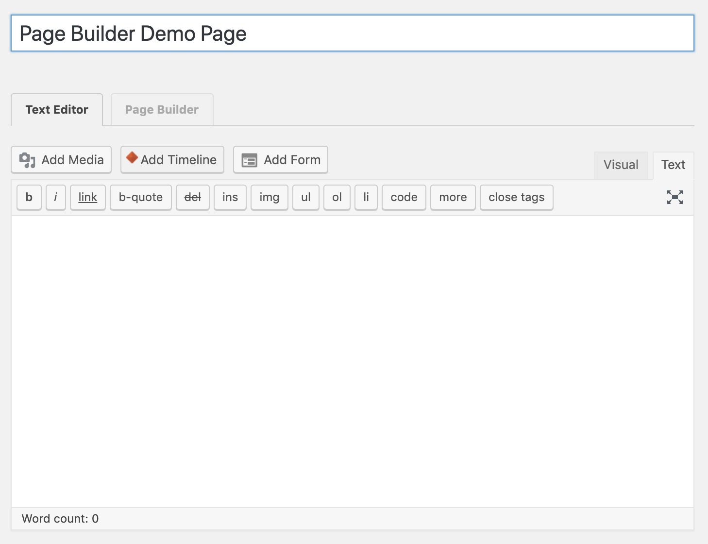
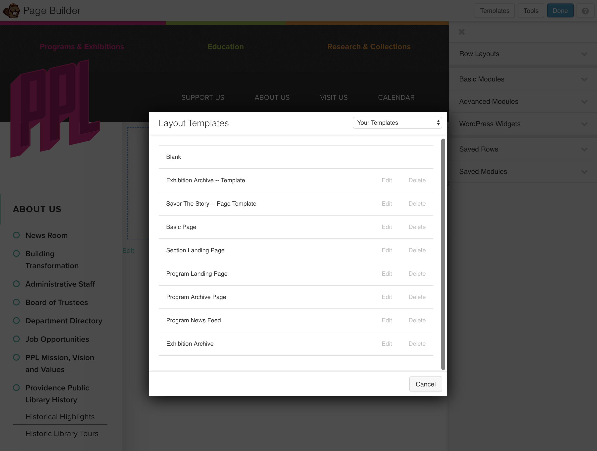
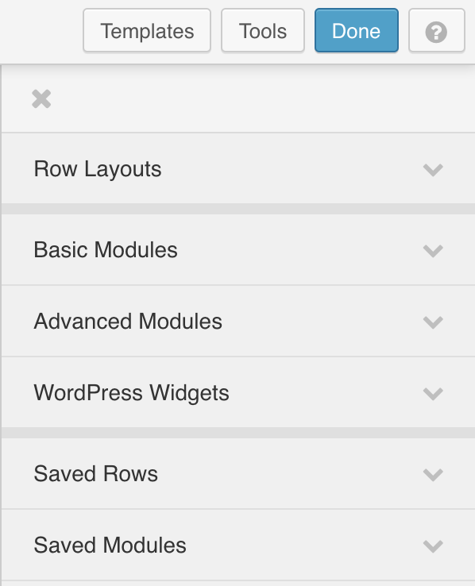
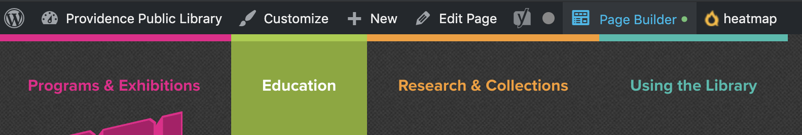
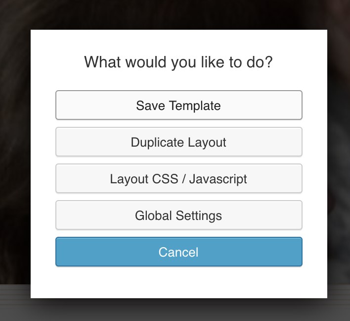
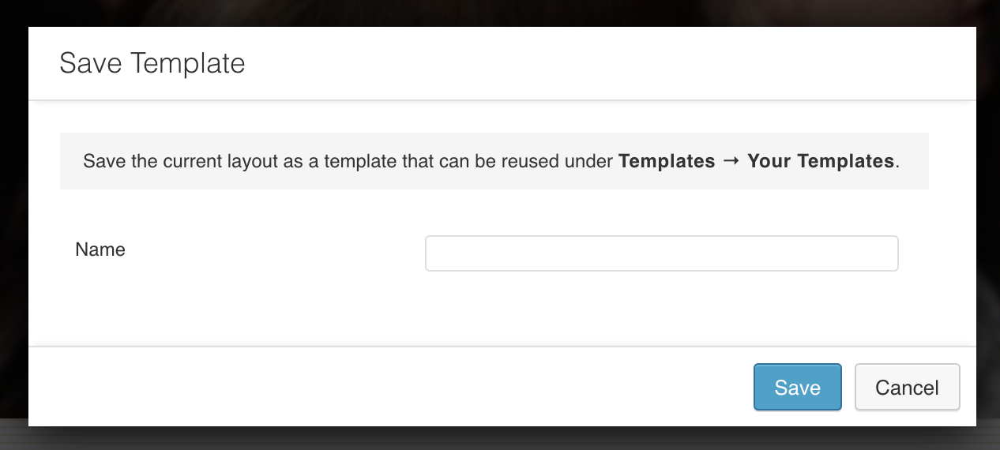

# Page Builder
---

**Table of contents**

* [About Page Builder](#about-page-builder)
* [Saved Templates](#saved-templates)
  - [How to save a page as a template](#how-to-save-a-page-as-a-template)
* [Saved Rows](#saved-rows)
  - [How to save a row as a saved row](#how-to-save-a-row-as-a-saved-row)
* [Saved Modules](#saved-modules)
  - [How to save a module as a saved module](#how-to-save-a-row-as-a-saved-row)

## About Page Builder

Page Builder (aka Beaver Builder) is the drag and drop plugin incorporated into our WordPress theme. 

:link: [Documentation](https://www.wpbeaverbuilder.com/)

Page Builder allows site admins and editors to build pages by dragging pre-built rows and modules.

#### Rows vs Modules
**Rows** are generally a collection of different types of content that occupy a full width row on a page.

**Modules** are things like buttons, paragraphs, images, headers, videos. Basically all of the content you can add to a row.

#### How to launch Page Builder from the WP Page/Post editor

1. Create a new page in WordPress.
2. In the WordPress editor you will see two tabs aboce the WYSIWYG Editor. One titled "Text Editor" and one titled "Page Builder".
3. Click the "Page Builder" tab to launch Page Builder.
4. When you create a new Page Builder page you have the option of starting the page using a Layout Template. If you want to start with a blank page just click "cancel" to dismiss the Layout Template modal.
5. Add content to the page by clicking one of the tabs in the right siderail.
  1. **Row Layouts** - Contains a selection of rows with different numbers of columns with set widths.
  2. **Basic Modules** - Contains basic content types you can drag into rows to start adding content. Examples are Headings (to great `<h1></h1>`, etc... headings), Photo, HTML (window you can write html code into), Text Editor (WYSIWYG editor), Video content.
  3. **Advanced Modules** - Lots of different types of modules. You can add a post listing of site post content, add a contact form, embed a map, add a menu to a page.
  4. **Saved Rows** - Contains pre-built rows. Any row you build for a page can be saved and re-used as a saved row.
  5. **Saved Modules** - Contains pre-built module content. Any part of a page builder row can be saved as a module and re-used as a saved module.

## Saved Templates

We have a number of Saved Templates built that should take care of most of the posting needs for ProvLib.org.

:link: [Basic Page](https://www.provlib.org/fl-builder-template/basic-page/)

The template used on most pages of this site. Comes with styled headers, paragraph text, and section headers and a featured image at the top.

:link: [Exhibition Archive - Template](https://www.provlib.org/fl-builder-template/exhibition-archive-template/)

Tempalte that can be used to create an page for an exhibition. Based on the **Basic Page** template. This template also includes an image gallery section, an exhibition sponors grid, an exhibition catalog embed (embed code is from issu and would need to be replaced).

:link: [Savor The Story - Page Template](https://www.provlib.org/fl-builder-template/savor-the-story-page-template/)

The template file used to build the Savor The Story pages for the 2018 and 2019 event.

:link: [Section Landing Page](https://www.provlib.org/fl-builder-template/section-landing-page/)

A template that can be used to build out a new website section landing page.

[Example of a section landing page](https://www.provlib.org/research-collections/)

:link: [Program Landing Page](https://www.provlib.org/fl-builder-template/program-landing-page/)

A page that could be used for a program landing page.

Ex: [Teen Squad Landing Page](https://www.provlib.org/education/teen-squad/)

:link: [Program Archive Page](https://www.provlib.org/fl-builder-template/program-archive-page/)

Similar to the **Program Landing Page** except it also contains a row to display previous iterations of the program with links to page for those programs.

:link: [Program News Feed](https://www.provlib.org/fl-builder-template/program-news-feed/)

A page that pulls in pages or posts with a specific content tag (ex: Teen Squad). This template could be used to create news feeds for different departments or library programs.

#### How to save a page as a template

_**Note:** The page needs to be using Page Builder._

1. Navigate to the page you want use as a Page Template.
2. Assuming you are logged into WordPress, click the **Page Builder** button on the top navigation.
3. Once Page Builder's editor has launched click the **Tools** button found in the top right of the screen.
4. A modal window will launch. Click the **Save Template** button. 
5. Enter a name for the template in the dialog box. Then click **Save**. 
6. You should now see your template as an option in the templates dialog or in the Beaver Builder Saved Templates admin area.
