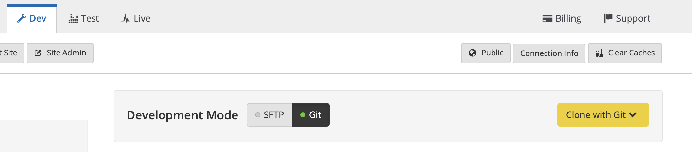
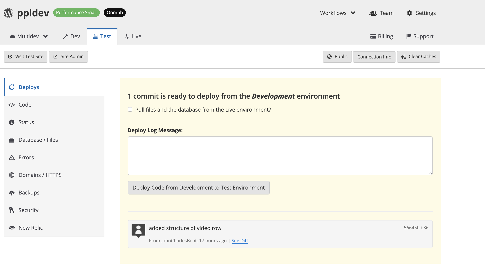
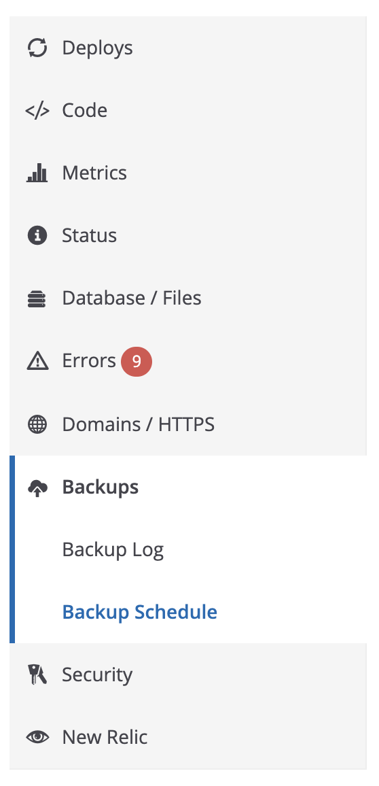

# Pantheon
----

Pantheon is the hosting provider for the Library's WordPress sites. Pantheon specialized in WordPress and Drupal hosting.

:link: [Pantheon Admin](https://pantheon.io/)
:link: [Pantheon Developer Docs](https://pantheon.io/docs/develop/)
:link: [Pantheon Terminus Command Line Tool](https://pantheon.io/docs/terminus/)

Pantheon provides hosting environment containing 3 branches of each site.

* **Dev** - Development branch. All code is pushed to Dev via git. Code is tested out here and/or debugged here.
  - **Dev URL** [http://dev-ppldev.pantheonsite.io](http://dev-ppldev.pantheonsite.io)
* **Test** - Test branch.
  - **Test URL** [http://test-ppldev.pantheonsite.io](http://dev-ppldev.pantheonsite.io)
* **Live** - Production branch. This is where [https://provlib.org](https://provlib.org) points to.
  - **Live URL** [http://live-ppldev.pantheonsite.io](http://live-ppldev.pantheonsite.io)
    - If you attempt to access the live url above you will redirected to ProvLib.org and the site will be served under HTTPs.

## Development and maintenance for Pantheon sites

Pantheon's uses an "upstream" development workflow. Code is pushed up the stream from Dev->Test->Live.

Databases and files are pushed down from Live->Test->Dev. Push data and files downstream is important. You run the risk of overwritting web site content or uploaded files if you push data/files upstream.

**Notable Exception**

The only instance where I push files upstream is when I need to add a Finding Aid to the [Special Collections section of ProvLib.org](https://www.provlib.org/research-collections/historical-collections/).

The Finding Aids on PPL are all linked from the Uploads directory [Example Finding Aid](https://www.provlib.org/wp-content/uploads/finding-aids/004-02-03-FA.pdf). Due to the need for Kate/Jordan to overwrite existing FA files, and not wanting to deal with deleting a file from the WP Media Gallery, then re-uploading, then relinking for each FA, it was determined that push the FA files upstream was the best workflow.

I typically push FA files first thing in the morning, at the end of the day, or off hours. Basically when I'm sure no one is adding new content to the live site.

**Process for adding an FA file to ProvLib**

1. Pull down database and files from live->test->dev.
2. Move new FA file or overwrite exisiting FA file using SFTP
  1. From the root directory in your SFTP client navigate to the **files** directory.
  2. Navigate to the **finding-aids** directory.
  3. Upload the new FA file, or add overwritten file to this directory.
3. Once the FA file has been added via SFTP push the files back upstream to live
  1. **Note** - you don't need to push the database back up.

### Development Mode

Your dev branch offers SFTP or Git as Development Modes.  You can toggle between those modes on the Dev Site dashboard for the pantheon site you are working in. If you want to update plugins or add new plugins from the WordPress admin you need to put the site into SFTP mode.

### Pushing Theme Code

 I push code up to dev using git. You can use SFTP but it is kind of a hassle.  Once you've pushed code to Dev and tested it you can move it to your Test and Live branches from each environments dashboard.

 

 To deploy code from Dev to Test (or Test to Live) click the **Deploy Code from [Env] to [Env] button**.

### Connecting to the Dev Pantheon branch database via a SQL client

You can find the credentials to connect to your Dev database by clicking the **Connection Info** button. 

This button allows gives connection info for Git,SFTP and Redis.

### Site Backups

Each pantheon branch can be backed up on a schedule or manually via the env dashboard.

Our live site is backed up every night at 1am. You can modify the backup schedule from the env dash by clicking (from the fray siderail menu) **Backups -> Backup Schedule**.

### Teminus Command Line connect_to_pantheon_sql

Pantheon has a really useful command line tool called Terminus.

:link: [Terminus Documentation](https://pantheon.io/docs/terminus/)

All of the maintenance tasks outlined above can be accomplished fairly quickly using Terminus. I would recommend reading the documentation and giving it a try.
