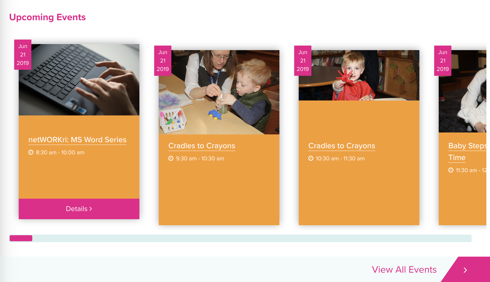
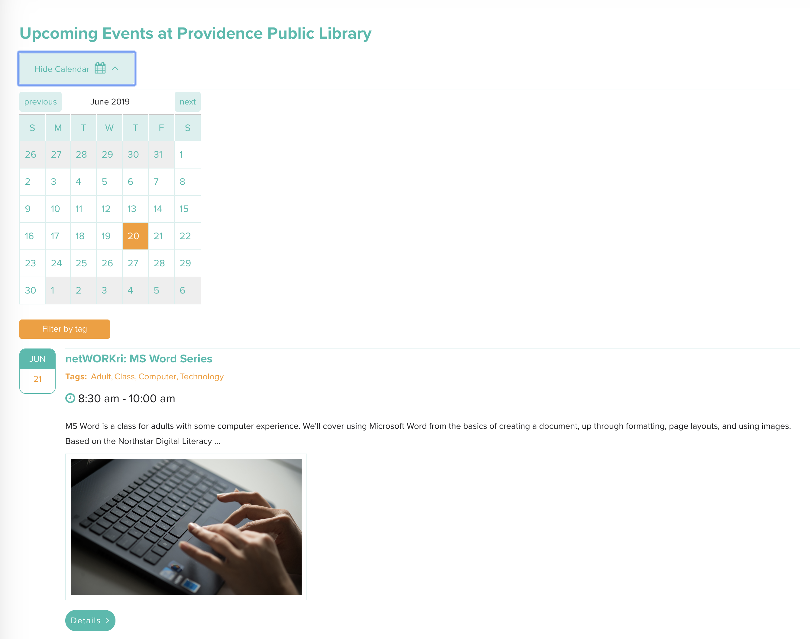
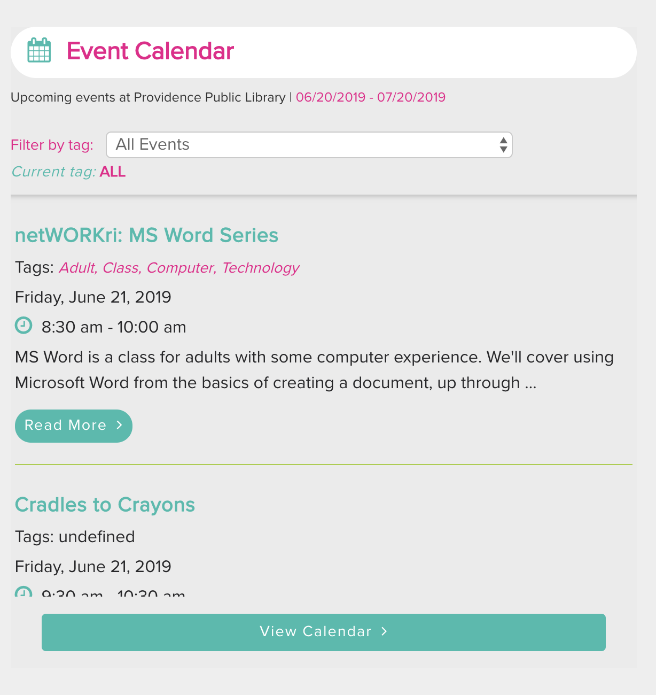
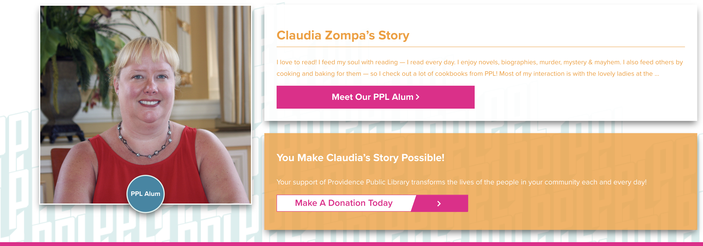
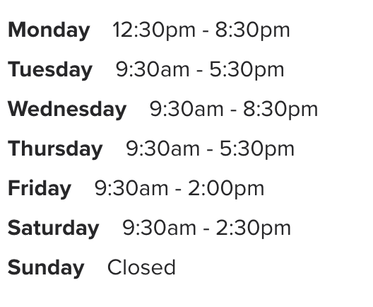
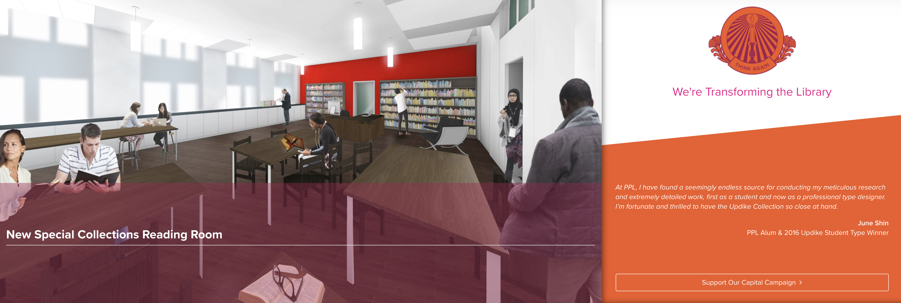

# ProvLib.org Shorcodes
---
Shortcodes being used on ProvLib.org.

[Shortcode information from WordPress codex](https://codex.wordpress.org/Shortcode).

##### Table of Contents
+ [Featured Events Row](#featured-events-row)
+ [Library Calendar](#library-calendar)
+ [Calendar List Display](#calendar-list-display)
+ [Random PPL Alum Row](#random-ppl-alum-row)
+ [2019 Exhbition Homepage Row](#2019-exhibition-homepage-row)
+ [Library Hours](#library-hours)
+ [Capital Campaign Row](#capital-campaign-rown)

## Featured Events Row

Displays a row of events pulled from the [LibCal API](https://provlib.libcal.com/admin/api).

#### Codebase
**PHP** :file_folder: /Users/dcc/Sites/ppldev/wp-content/plugins/libcal-for-wordpress/inc/display/featured_events_display.php

**SCSS/CSS** :file_folder: /Users/dcc/Sites/ppldev/wp-content/plugins/libcal-for-wordpress/sass/partials/_eventFeed.scss


#### Shortcode
```php
[featuredEvents display="scroll" all_events="yes" name=”Name”][/featuredEvents]
```


#### Front End Display



#### Attributes
You can alter the display of this row by using these attributes

**display="[scroll | grid]"** _~ defaults to grid_

Set the display of the tiles as a horizontal row with a scroll bar or as a grid.

**all_events="[yes | no]"** _~ defaults to yes_

Pull in all upcoming events for the next 30 days if set to yes.

**name="[name of event list]"** _~ optional attribute_

If this attribute is set it overrides the all_events attribute and pulls in a curated feed of events set in the [Library Calendar Admin](https://www.provlib.org/wp-admin/admin.php?page=edit-feature-events).

## Library Calendar
---
Shortcode used to generate the full calendar display found on the [calendar page on ProvLib.org](https://www.provlib.org/calendar)



#### Codebase
**PHP** :file_folder: /Users/dcc/Sites/ppldev/wp-content/plugins/libcal-for-wordpress/inc/display/event_feed_full.php

**SCSS/CSS** :file_folder: /Users/dcc/Sites/ppldev/wp-content/plugins/libcal-for-wordpress/sass/partials/_fullCal.scss

#### Shortcode
```php
[fullCalendar][/fullCalendar]
```

## Calendar List Display
---
Display a list of events from the LibCal API for the next 30 days. Event can be filtered using event categories.  The shortcode can be set to display events fron one specific category using a shortcode attribute.



#### Codebase
**PHP** :file_folder: /Users/dcc/Sites/ppldev/wp-content/plugins/libcal-for-wordpress/inc/display/event_feed_widget.php

**SCSS/CSS** :file_folder: /Users/dcc/Sites/ppldev/wp-content/plugins/libcal-for-wordpress/sass/partials/_eventFeed.scss

#### Shortcode
```php
[Calendar][/Calendar]
```

#### Attributes
You can alter the display of this row by using these attributes

**tag="[category tag name]"** _~ defaults to All_

Optional attribute that can be used to specifiy a LibCal category tag used to display only events in that category on page load.

## Random PPL Alum Row
---

#### Codebase
**PHP** :file_folder: /Users/dcc/Sites/ppldev/wp-content/themes/ppl/inc/ppl-alum.php

**SCSS/CSS** :file_folder: /Users/dcc/Sites/ppldev/wp-content/ppl/scss/partials/_alum.scss

_SASS for Random Alum row begins on line 405_

#### Shortcode

```php
[randomAlum][/randomAlum]
```



Pulls in random PPL Alum content from the PPL Alum custom post type. This row comes pre-styled and features a donation call to action button.

## 2019 Exhibition Homepage Row
---
Pulls in data related to one of the 12 exhibition sites featured in the PPL 2019 exhibition **41.8219&deg;, 71.7171&deg;**.


[Admin Area For Row Content](https://www.provlib.org/wp-admin/admin.php?page=exhibition-homepage-row-settings)

#### Codebase
**PHP** :file_folder: /Users/dcc/Sites/ppldev/wp-content/themes/ppl/inc/exhibition.php

**SCSS/CSS** :file_folder: /Users/dcc/Sites/ppldev/wp-content/ppl/scss/partials/_exhibition2019.scss

#### Shortcode
```php
[exhibitionHighlights][/exhibitionHighlights]
```

## Library Hours
---

Displays library hours set in the [WordPress PPL Admin Area](https://www.provlib.org/wp-admin/options-general.php?page=site_settings)



#### Codebase
**PHP** :file_folder:  /Users/dcc/Sites/ppldev/wp-content/themes/ppl/ppl-hours.php

#### Shortcode

```php
[libraryHours][/libraryHours]
```
## Capital Campaign Row
---
Displays a row that features an image of the library pre-renovation and a rendering of the library post-renovation. The images, when hovered over, fade in and out or flip, depending on the attribute passed.



[Admin Area For Row Content](https://dev-ppldev.pantheonsite.io/wp-admin/admin.php?page=think-again-row-settings)


#### Codebase
**PHP** :file_folder: /Users/dcc/Sites/ppldev/wp-content/themes/ppl/think-again.php

**SCSS/CSS** :file_folder: /Users/dcc/Sites/ppldev/wp-content/ppl/scss/partials/_homepage.scss


#### Shortcode
```php
[thinkAgainRow][/thinkAgainRow]
```
